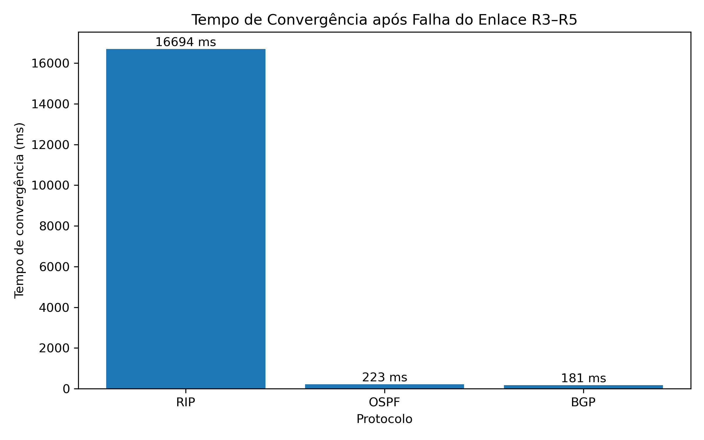
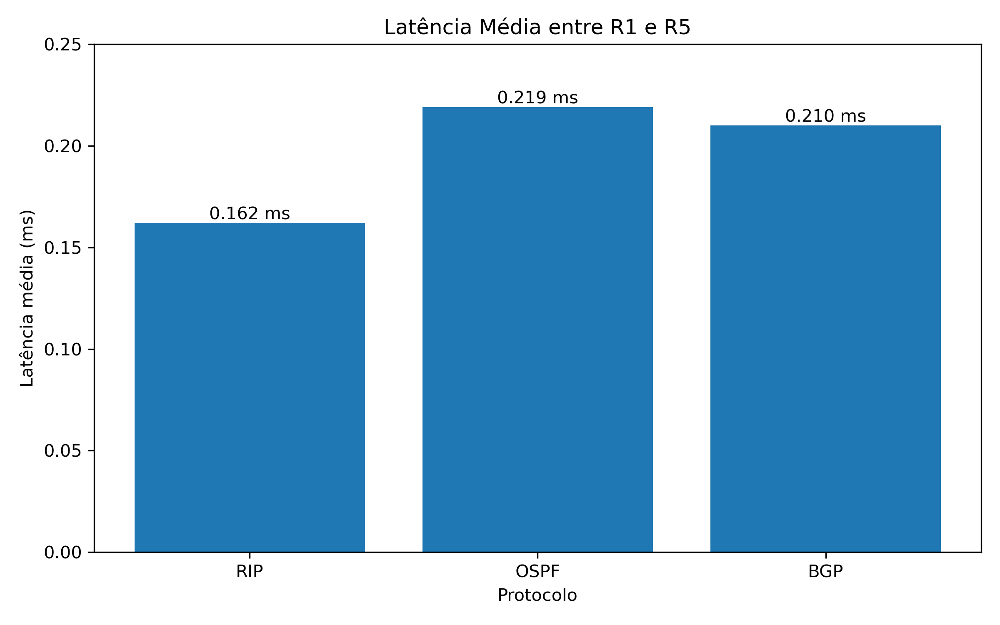
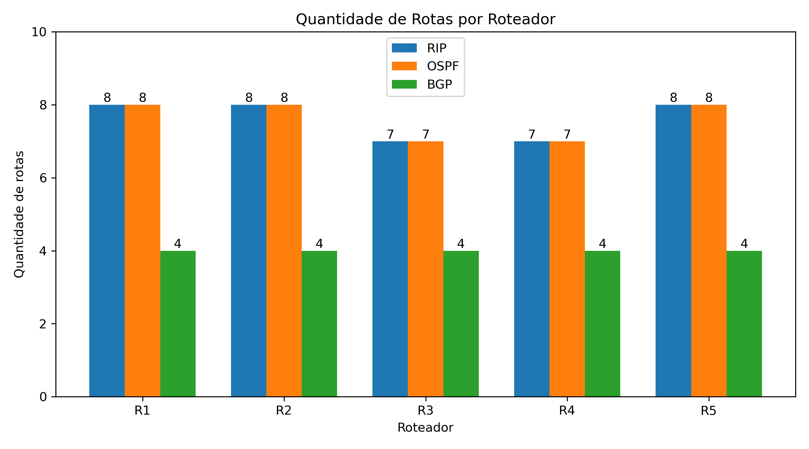
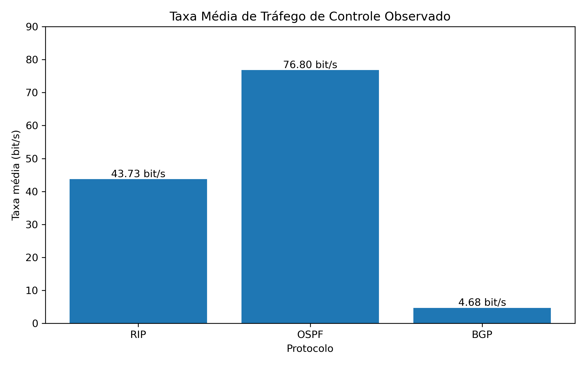

# Trabalho Experimental de Roteamento IP

**Aluno:** Gabriel Heyde  
**Instituição:** Universidade do Vale do Rio dos Sinos — UNISINOS  
**Disciplina:** Fundamentos de Sistemas Operacionais  

---

## 1. Sobre o trabalho

Este projeto apresenta uma implementação experimental de roteamento IP utilizando três protocolos de roteamento: **RIP, OSPF e BGP**.

O ambiente foi desenvolvido utilizando **Docker, Docker Compose e FRRouting (FRR)**. A topologia é composta por cinco roteadores distribuídos entre três Sistemas Autônomos (AS), com diferentes enlaces entre eles e caminhos alternativos.

O objetivo principal do experimento é configurar os três protocolos sobre uma mesma topologia e observar algumas diferenças de comportamento através de métricas como:

- quantidade de rotas aprendidas;
- latência entre os roteadores;
- tráfego de controle gerado;
- tempo de convergência após uma falha de enlace.

Os protocolos foram executados separadamente, mantendo a mesma topologia física para permitir a comparação dos resultados.

---

# 2. Tecnologias utilizadas

Para a construção do ambiente foram utilizadas as seguintes tecnologias:

- **Docker**
- **Docker Compose**
- **FRRouting (FRR)**
- **Ubuntu através do WSL2**
- **Python 3**
- **Matplotlib**
- **tcpdump**
- **Netshoot**

O FRRouting foi utilizado para implementar os protocolos RIP, OSPF e BGP nos roteadores virtuais.

---

# 3. Topologia da rede

A topologia possui cinco roteadores:

```text
                    R1
                  /    \
                 /      \
                R2      R3
                 \      / \
                  \    /   \
                   R4 ----- R5
```

Os enlaces existentes são:

```text
R1 --- R2
R1 --- R3
R2 --- R4
R3 --- R4
R3 --- R5
R4 --- R5
```

Essa organização permite que existam **caminhos alternativos** caso algum dos enlaces seja interrompido.

Por exemplo, para alcançar R5 a partir de R3 existe o caminho direto:

```text
R3 → R5
```

mas também existe o caminho alternativo:

```text
R3 → R4 → R5
```

Esse caminho foi utilizado nos testes de convergência.

---

## 3.1 Redes de acesso

Cada roteador possui sua própria rede de acesso:

| Roteador | Rede | Endereço do roteador |
|---|---|---|
| R1 | `192.168.1.0/24` | `192.168.1.2` |
| R2 | `192.168.2.0/24` | `192.168.2.2` |
| R3 | `192.168.3.0/24` | `192.168.3.2` |
| R4 | `192.168.4.0/24` | `192.168.4.2` |
| R5 | `192.168.5.0/24` | `192.168.5.2` |

---

## 3.2 Redes entre os roteadores

Os enlaces entre os roteadores utilizam as seguintes redes:

| Enlace | Rede | Primeiro roteador | Segundo roteador |
|---|---|---|---|
| R1–R2 | `10.0.12.0/29` | R1: `10.0.12.2` | R2: `10.0.12.3` |
| R1–R3 | `10.0.13.0/29` | R1: `10.0.13.2` | R3: `10.0.13.3` |
| R2–R4 | `10.0.24.0/29` | R2: `10.0.24.2` | R4: `10.0.24.3` |
| R3–R4 | `10.0.34.0/29` | R3: `10.0.34.2` | R4: `10.0.34.3` |
| R3–R5 | `10.0.35.0/29` | R3: `10.0.35.2` | R5: `10.0.35.3` |
| R4–R5 | `10.0.45.0/29` | R4: `10.0.45.2` | R5: `10.0.45.3` |

Foi utilizada a máscara `/29` nos enlaces devido à utilização das redes bridge do Docker.

---

# 4. Sistemas Autônomos

Para os testes com BGP, os cinco roteadores foram divididos em **três Sistemas Autônomos**.

| Sistema Autônomo | Roteadores |
|---|---|
| **AS 100** | R1 e R2 |
| **AS 200** | R3 e R4 |
| **AS 300** | R5 |

A organização utilizada foi:

```text
             AS 100              AS 200              AS 300

          ┌──────────┐        ┌──────────┐        ┌──────────┐
          │ R1    R2 │        │ R3    R4 │        │    R5    │
          └──────────┘        └──────────┘        └──────────┘
```

Dentro do mesmo AS foram utilizadas sessões **iBGP**, enquanto as conexões entre AS diferentes utilizaram **eBGP**.

As principais sessões configuradas foram:

```text
iBGP:
R1 ↔ R2
R3 ↔ R4

eBGP:
R1 ↔ R3
R2 ↔ R4
R3 ↔ R5
R4 ↔ R5
```

---

# 5. Estrutura do projeto

Os arquivos estão organizados da seguinte forma:

```text
trabalho-roteamento/
│
├── docker-compose.yml
│
├── configs/
│   ├── rip/
│   │   ├── R1/
│   │   ├── R2/
│   │   ├── R3/
│   │   ├── R4/
│   │   └── R5/
│   │
│   ├── ospf/
│   │   ├── R1/
│   │   ├── R2/
│   │   ├── R3/
│   │   ├── R4/
│   │   └── R5/
│   │
│   └── bgp/
│       ├── R1/
│       ├── R2/
│       ├── R3/
│       ├── R4/
│       └── R5/
│
├── scripts/
│   ├── gerar_graficos.py
│   ├── teste_convergencia_rip.sh
│   ├── teste_convergencia_ospf.sh
│   └── teste_convergencia_bgp.sh
│
└── resultados/
    ├── rip/
    ├── ospf/
    ├── bgp/
    └── graficos/
```

Cada roteador possui os arquivos:

```text
daemons
frr.conf
```

O arquivo `daemons` determina quais serviços do FRRouting são iniciados, enquanto o arquivo `frr.conf` contém a configuração do protocolo de roteamento.

---

# 6. Protocolos implementados

## 6.1 RIP

O primeiro protocolo configurado foi o **RIP versão 2**.

Durante esse experimento somente o daemon correspondente ao RIP foi habilitado nos roteadores.

Foram anunciadas as redes conectadas a cada roteador, permitindo que os demais equipamentos aprendessem as rotas através das atualizações do protocolo.

Entre as características observadas no ambiente estão as atualizações periódicas do RIP e o tempo maior para adaptação da tabela após a interrupção de um enlace.

---

## 6.2 OSPF

O segundo protocolo utilizado foi o **OSPF**.

Todos os roteadores foram configurados na **área 0**, formando uma única área OSPF.

Foram definidos Router IDs diferentes para cada roteador:

| Roteador | Router ID |
|---|---|
| R1 | `1.1.1.1` |
| R2 | `2.2.2.2` |
| R3 | `3.3.3.3` |
| R4 | `4.4.4.4` |
| R5 | `5.5.5.5` |

O estabelecimento das adjacências foi verificado através do FRRouting antes da realização dos testes.

---

## 6.3 BGP

O terceiro protocolo implementado foi o **BGP**.

Nesse cenário foram utilizados os três Sistemas Autônomos definidos anteriormente.

As redes de acesso anunciadas pelo BGP foram:

```text
R1 → 192.168.1.0/24
R2 → 192.168.2.0/24
R3 → 192.168.3.0/24
R4 → 192.168.4.0/24
R5 → 192.168.5.0/24
```

As sessões BGP foram verificadas antes dos testes para confirmar que os vizinhos estavam no estado **Established**.

---

# 7. Metodologia dos testes

Os testes foram realizados separadamente para RIP, OSPF e BGP.

Foram analisadas quatro métricas principais:

### 7.1 Quantidade de rotas

Foi contabilizada a quantidade de rotas aprendidas por cada roteador durante a execução de cada protocolo.

### 7.2 Latência

A latência foi medida através de **20 pacotes ICMP** enviados do R1 para a rede de acesso do R5.

O valor utilizado na comparação foi o RTT médio apresentado pelo `ping`.

### 7.3 Tráfego de controle

O tráfego gerado pelos protocolos foi observado utilizando o `tcpdump`.

Para RIP e OSPF foi utilizada uma janela de observação de 60 segundos.

Para BGP foi utilizada uma janela de 130 segundos devido ao intervalo de aproximadamente 60 segundos entre as mensagens KEEPALIVE observadas.

### 7.4 Tempo de convergência

Para avaliar a reação dos protocolos a uma falha, foi interrompido o enlace:

```text
R3 --- R5
```

Antes da falha, R3 alcançava a rede de R5 diretamente.

```text
R3 → R5
```

Após a interrupção, foi medido o tempo necessário para que a tabela de roteamento passasse a utilizar o caminho alternativo:

```text
R3 → R4 → R5
```

A rede observada foi:

```text
192.168.5.0/24
```

---

# 8. Resultados

## 8.1 Tempo de convergência

Os tempos observados foram:

| Protocolo | Tempo de convergência |
|---|---:|
| RIP | **16.694 ms** |
| OSPF | **223 ms** |
| BGP | **181 ms** |



O RIP apresentou um tempo de convergência consideravelmente maior neste experimento.

OSPF e BGP reagiram de forma muito mais rápida à falha simulada. No caso do BGP, a interrupção ocorreu diretamente na interface que mantinha a sessão com R5 e já existia uma rota alternativa através de R4.

Por esse motivo, o resultado de 181 ms do BGP **não deve ser interpretado como uma conclusão geral de que BGP converge mais rapidamente que OSPF**. O resultado representa apenas o comportamento observado nesta topologia e nesta condição de teste.

---

## 8.2 Latência

Os resultados médios obtidos através dos testes de `ping` foram:

| Protocolo | RTT médio |
|---|---:|
| RIP | **0,162 ms** |
| OSPF | **0,219 ms** |
| BGP | **0,210 ms** |



Os valores ficaram bastante próximos entre os três protocolos.

Isso ocorre porque o ambiente utilizado é virtual e executado localmente através do Docker. Além disso, depois que uma rota é instalada na tabela, o encaminhamento dos pacotes não depende diretamente do algoritmo utilizado para calcular essa rota.

Portanto, as pequenas diferenças observadas não são suficientes para afirmar que um dos protocolos possui menor latência de encaminhamento de forma geral.

---

## 8.3 Quantidade de rotas

A quantidade de rotas observada foi:

| Roteador | RIP | OSPF | BGP |
|---|---:|---:|---:|
| R1 | 8 | 8 | 4 |
| R2 | 8 | 8 | 4 |
| R3 | 7 | 7 | 4 |
| R4 | 7 | 7 | 4 |
| R5 | 8 | 8 | 4 |



RIP e OSPF apresentaram valores semelhantes porque as redes de trânsito entre os roteadores também participaram da propagação das rotas.

No experimento com BGP foram anunciadas somente as redes de acesso `192.168.x.0/24`.

Por isso, a quantidade menor de rotas BGP **não representa diretamente uma maior eficiência do protocolo**. Os conjuntos de redes anunciadas não são exatamente equivalentes nessa métrica.

---

## 8.4 Tráfego de controle

Os resultados observados foram:

| Protocolo | Dados observados | Janela | Taxa média |
|---|---:|---:|---:|
| RIP | 328 bytes | 60 s | **43,73 bit/s** |
| OSPF | 576 bytes | 60 s | **76,80 bit/s** |
| BGP | 76 bytes* | 130 s | **4,68 bit/s*** |



No RIP foram observadas atualizações periódicas do protocolo.

No OSPF foram observadas mensagens Hello, utilizadas para a manutenção das adjacências entre os roteadores.

No BGP foram observadas mensagens KEEPALIVE aproximadamente a cada 60 segundos.

> **Observação:** no caso do BGP, os 76 bytes correspondem ao payload das mensagens BGP indicado pelo `tcpdump`. Foram observadas quatro mensagens BGP de 19 bytes durante a janela de 130 segundos. Os cabeçalhos TCP/IP e Ethernet não foram incluídos nesse cálculo.

Por esse motivo, a comparação deve ser entendida como uma observação experimental do tráfego capturado, e não como uma medição completa do consumo de banda de cada protocolo em qualquer cenário.

---

# 9. Análise dos resultados

Os experimentos mostraram diferenças importantes entre os três protocolos.

O **RIP** apresentou o maior tempo de convergência após a falha do enlace R3–R5. Isso está relacionado ao comportamento do protocolo e aos mecanismos utilizados para atualização das rotas.

O **OSPF** apresentou uma reação rápida à alteração da topologia, instalando o caminho alternativo em 223 ms no teste realizado.

O **BGP** também apresentou uma troca rápida de rota neste cenário, com 181 ms. Entretanto, esse resultado foi influenciado pela forma como a falha foi simulada, pois a interface local da sessão eBGP foi derrubada diretamente e uma alternativa através de R4 já estava disponível.

Em relação à latência, os três protocolos apresentaram resultados muito próximos. Como os testes foram realizados em um ambiente virtual local, não foram introduzidos atrasos significativos nos enlaces.

A análise do tráfego de controle também mostrou comportamentos diferentes. RIP enviou suas atualizações periódicas, OSPF manteve a comunicação através de mensagens Hello e BGP apresentou principalmente mensagens KEEPALIVE durante o período observado.

Dessa forma, os resultados mostram que cada protocolo possui mecanismos e objetivos diferentes, e que as métricas devem ser analisadas considerando as características da topologia e a metodologia utilizada.

---

# 10. Como executar o projeto

## 10.1 Pré-requisitos

Para executar o ambiente são necessários:

- Docker;
- Docker Compose;
- suporte a containers Linux;
- Python 3 para geração dos gráficos.

---

## 10.2 Inicializando os roteadores

Na pasta principal do projeto:

```bash
docker compose up -d
```

Para verificar os containers:

```bash
docker compose ps
```

---

## 10.3 Acessando o FRRouting

Por exemplo, para acessar o R1:

```bash
docker exec -it R1 vtysh
```

Dentro do FRRouting podem ser utilizados comandos como:

```text
show ip route
```

Para BGP:

```text
show ip bgp
show bgp summary
```

Para OSPF:

```text
show ip ospf neighbor
show ip ospf route
```

Para RIP:

```text
show ip rip status
show ip rip
```

---

## 10.4 Testes de convergência

Os scripts utilizados nos testes estão disponíveis na pasta `scripts`.

### RIP

```bash
./scripts/teste_convergencia_rip.sh
```

### OSPF

```bash
./scripts/teste_convergencia_ospf.sh
```

### BGP

```bash
./scripts/teste_convergencia_bgp.sh
```

Os scripts simulam a falha do enlace R3–R5 e registram o tempo necessário para instalação do caminho alternativo.

---

## 10.5 Gerando os gráficos

Os gráficos podem ser gerados através do script:

```bash
python3 scripts/gerar_graficos.py
```

Os arquivos serão criados em:

```text
resultados/graficos/
```

---

# 11. Arquivos de resultados

Os resultados brutos dos experimentos foram mantidos no repositório para permitir a consulta dos dados utilizados nos gráficos.

```text
resultados/
├── rip/
│   ├── convergencia.txt
│   ├── latencia_R1_R5.txt
│   ├── quantidade_rotas.txt
│   └── trafego_controle_R1_R2.txt
│
├── ospf/
│   ├── convergencia.txt
│   ├── latencia_R1_R5.txt
│   ├── quantidade_rotas.txt
│   └── trafego_controle_R1_R2.txt
│
├── bgp/
│   ├── convergencia.txt
│   ├── latencia_R1_R5.txt
│   ├── quantidade_rotas.txt
│   └── trafego_controle_R1_R2.txt
│
└── graficos/
```

Isso permite consultar tanto os resultados apresentados quanto as saídas originais dos testes.

---

# 12. Conclusão

A implementação permitiu observar na prática o funcionamento de três protocolos de roteamento com características diferentes.

A utilização do FRRouting em conjunto com Docker possibilitou construir uma topologia com cinco roteadores, múltiplos enlaces, três Sistemas Autônomos e caminhos alternativos sem a necessidade de equipamentos físicos.

Nos testes realizados, a diferença mais evidente ocorreu no tempo de convergência. O RIP necessitou aproximadamente 16,7 segundos para utilizar o caminho alternativo, enquanto OSPF e BGP realizaram a mudança em menos de um segundo no cenário testado.

As medições também mostraram que a interpretação dos resultados depende da forma como cada experimento é realizado. A quantidade de rotas do BGP, por exemplo, não pode ser comparada diretamente com RIP e OSPF porque apenas as redes de acesso foram anunciadas pelo BGP.

Assim, além da configuração dos protocolos, o experimento permitiu analisar como RIP, OSPF e BGP reagem a alterações na rede e como diferentes métricas podem ser utilizadas para observar seu comportamento.

---
